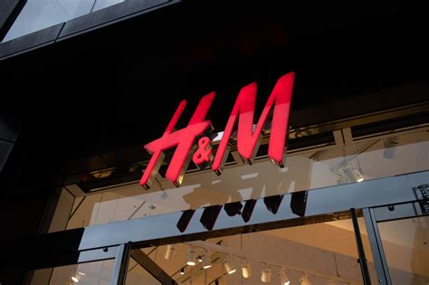

# H&M Kaggle competition
 Data-science project to build a recommender system for H&M products

## Table of Contents
* [General Info](#general-information)
* [Technologies Used](#technologies-used)
* [I. EDA](#I.-Data-Collection-&-ETL)
* [II. Data preparation](#II.-EDA)
* [III. Recommender systemn](#III.-Price-prediction)
<!-- * [License](#license) -->

## General Information

H&M Group is a family of brands and businesses with 53 online markets and approximately 4,850 stores. Our online store offers shoppers an extensive selection of products to browse through. But with too many choices, customers might not quickly find what interests them or what they are looking for, and ultimately, they might not make a purchase. To enhance the shopping experience, product recommendations are key. More importantly, helping customers make the right choices also has a positive implications for sustainability, as it reduces returns, and thereby minimizes emissions from transportation.

In this competition, H&M Group invites you to develop product recommendations based on data from previous transactions, as well as from customer and product meta data. The available meta data spans from simple data, such as garment type and customer age, to text data from product descriptions, to image data from garment images.

There are no preconceptions on what information that may be useful – that is for you to find out. If you want to investigate a categorical data type algorithm, or dive into NLP and image processing deep learning, that is up to you.

https://www.kaggle.com/competitions/h-and-m-personalized-fashion-recommendations

## Technologies Used

- PYTHON3 - version 3.9: Pandas,Dask, Matplotlib, Seaborn, Sklearn, Optuna

### I. Exploratory analysis and data visualization

[EDA NOTEBOOK](./01_EDA/HM-EDA.ipynb)

- exploring the datasets and answering some high level questions

### II. Data preparation
    (in progress)

### III. Recommender system
    (in progress)

